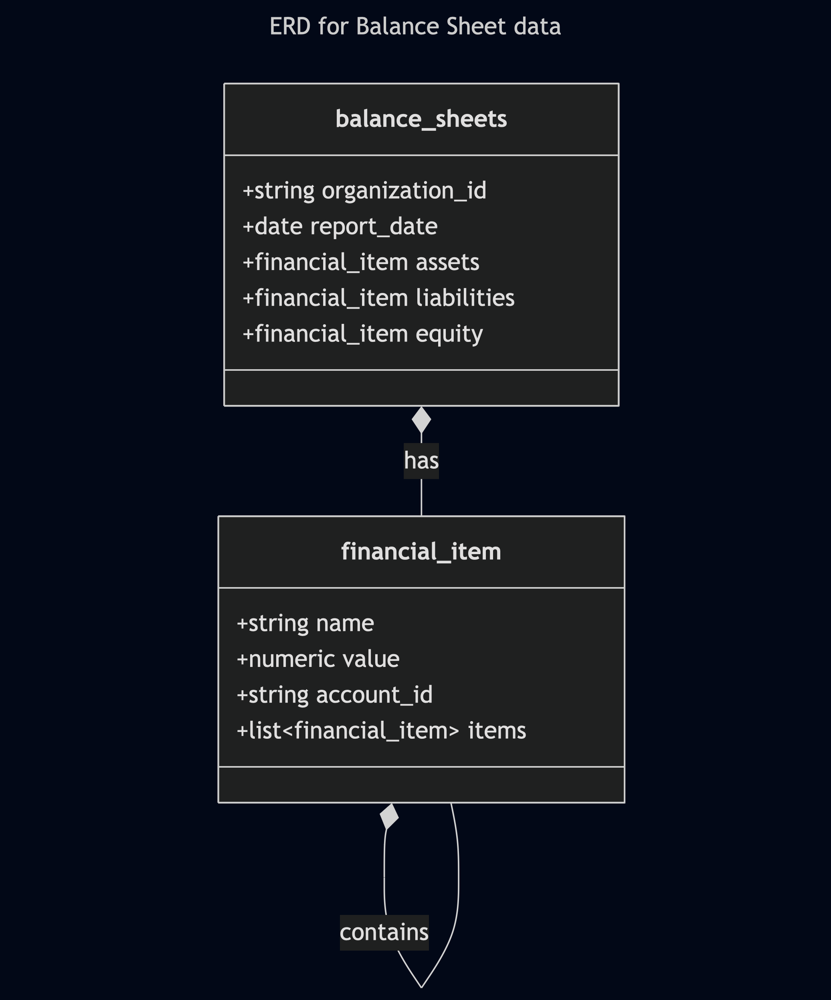

# Approach

For this data modeling exercise, I decided to go with BigQuery because Flex is already utilizing it as part of their GCP adoption. BigQuery, being a modern data warehouse, supports **denormalized** data models. According to the [public documentation](https://cloud.google.com/bigquery/docs/best-practices-performance-nested): "It's best to use this strategy when the relationships are hierarchical and frequently queried together, such as in parent-child relationships."

A traditional normalized data model creates multiple tables. This creates a more "clean" and efficient data model because it saves on redundant data. However, it would require multiple `JOIN`s and foreign keys would be less performant and more complex to query in BigQuery.

**Performance**:

Denormalization is made possible by the use of `ARRAY` and `STRUCT` objects. It "flattens" the data structure of the balance sheet to a single row. Queries that analyze the details of a single balance sheet at a given point in time will be much faster.

**Scalability**:

This design scales well as more balance sheets are added over time. Each new balance sheet is simply a new row in the table. This allows us to have snapshots and do time-based comparisons.

**Sample Queries**:

These sample queries below show how easy and intuitive it is to query hierarchical data in BigQuery.

Get the value of particular type of asset:

```sql
SELECT
  bank_account.name AS bank_account_name,
  bank_account.value AS bank_account_value
FROM
  `balance_sheets`,
  UNNEST(assets.items) AS current_assets,
  UNNEST(current_assets.items) AS bank_accounts_group,
  UNNEST(bank_accounts_group.items) AS bank_account
WHERE
  -- First, find the 'Current Assets' group
  current_assets.name = 'Current Assets'
  -- Then, find the 'Bank Accounts' sub-group
  AND bank_accounts_group.name = 'Bank Accounts';
```

Get the total values of all credit cards

```sql
SELECT
  SUM(credit_card.value) AS total_credit_card_liabilities
FROM
  `balance_sheets`,
  UNNEST(liabilities.items) AS current_liabilities,
  UNNEST(current_liabilities.items) AS credit_card_group,
  UNNEST(credit_card_group.items) AS credit_card_main,
  UNNEST(credit_card_main.items) AS credit_card
WHERE
  current_liabilities.name = 'Current Liabilities'
  AND credit_card_group.name = 'Credit Cards';
```

## Issues/inconsistencies

### Un-balanced equation

The most critical issue I found is that the equation (`Assets == Liabilities + Equity`) is not balanced at the top-level:

- Total Assets: $13,318,970.87
- Total Liabilities: $1,025,016.99
- Total Equity: $12,399,101.55

This sum of $13,424,118.54 does not equal the Total Assets of $13,318,970.87. The balance sheet is off by **$105,147.67**.

Also, by running the validation script, 'Current Liabilities' do not add up: Expected: 1014525.75, Calculated: 937527.65, Difference: -76998.1

### Data Type for Monetary Values

All monetary values are stored as string in the JSON file. JSON supports numeric values, they should be used.

### Anomalous Values

1. Negative Bank Balances: The Flex Checking account has a large negative balance of -$1,272,375.00, and the Flex 2761 account is also negative at -$47,077.50. Not sure if this is an over-draft situation?

1. Negative Credit Card Balance: The Flex Platinum Card has a balance of -$25,000.00. Not sure if this means the credit card was over-paid to increase spending limit?

1. Inconsistent `account_id` usage: Sometimes it is present and other times it is missing.

## Data Modeling



## Data Validation

Currently, data validation is done to check if the child-level accounts roll-up to the parent level.

Run the script as follows:

```sh
python validate_financials.py balance_sheet.json
```

> NOTE: Need Python 3.9.6 to run

**Example output**:

```sh
Discrepancies found:
Path: LIABILITIES/Liabilities/Current Liabilities, Expected: 1014525.75, Calculated: 937527.65, Difference: -76998.1
```

## Next Steps

If I had more time, I would conduct the following types of checks and logging:

a. Missing or Duplicate IDs

- Traverse and collect all account_id and section IDs.
- Check for missing or duplicate values.
- Check to see if all sections of the balance sheets are present, even if they are zero: assets, liabilities, equity

b. Data Types

- Ensure all "value" fields are numeric.
- Report any non-numeric or missing values.

c. Negative Values

- Flag negative values that may be unexpected (e.g., negative asset balances).

d. Unbalanced Equation

- Check: Assets = Liabilities + Equity
- In this particular case, the sum of $13,424,118.54 does not equal the Total Assets of $13,318,970.87. The balance sheet is off by $105,147.67.

e. Robust Logging

- Currently, the script prints to STDOUT
- Use the `logging` library or sanity checks in the data pipeline itself

## Summary of checks to conduct

| **Check**                  | **How to Implement**                        |
|----------------------------|---------------------------------------------|
| Roll-up validation         | Recursive sum and compare                   |
| Data type enforcement      | Parse and check for floats                  |
| ID uniqueness              | Collect and check for duplicates            |
| Missing values             | Check for None or missing fields            |
| Negative value flagging    | Conditional checks on account types         |
| Balance sheet equation     | Assets == Liabilities + Equity              |

Alternatively, I could also experiment with having these checks done purely in SQL.
This would allow for simpler deployment in tools like `dbt` because the application
stack is simpler.  But this assumes that the input data is already in SQL-readable format.
